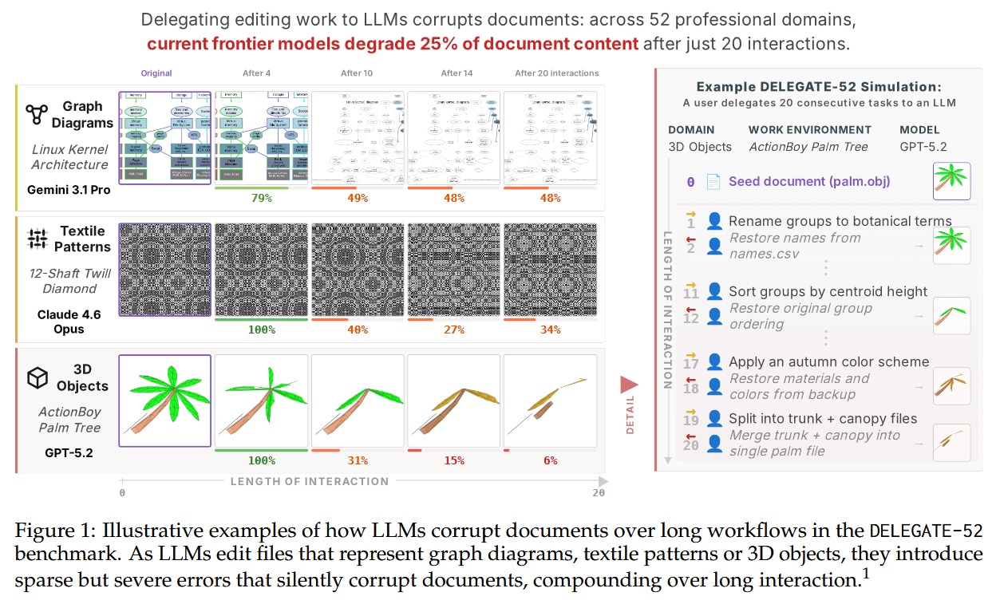
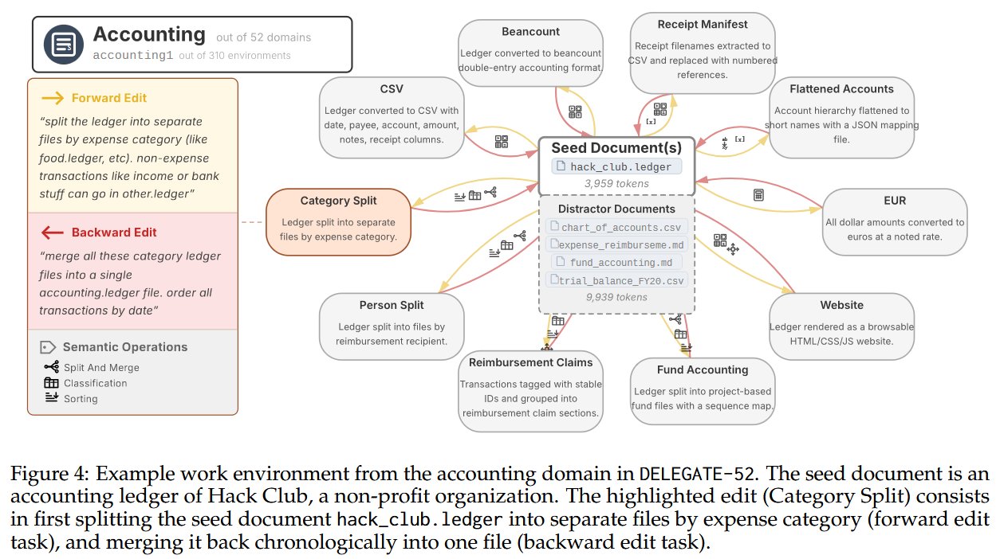
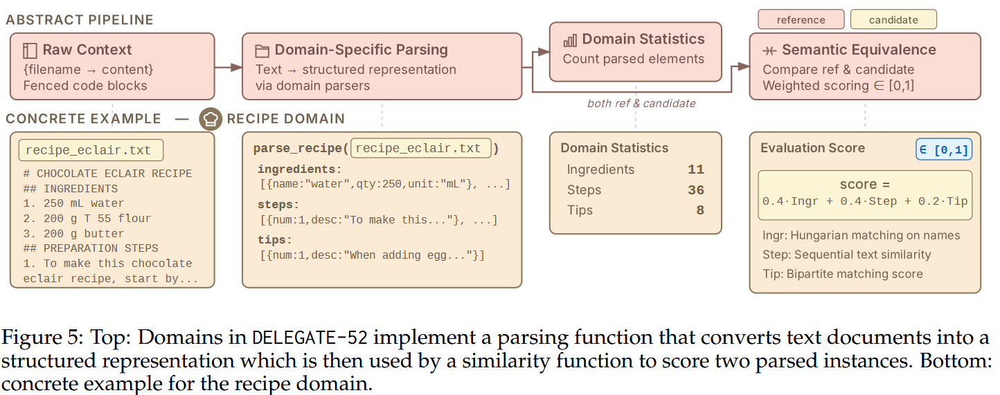

---
language:
- en
license: cdla-permissive-2.0
task_categories:
- text-generation
tags:
- benchmark
- document-editing
- llm-evaluation
- delegation
- round-trip
pretty_name: DELEGATE52
size_categories:
- n<1K
configs:
  - config_name: default
    data_files:
      - split: test
        path: delegate52.jsonl
---

# DELEGATE52

<p align="center">
  
</p>

## Overview

DELEGATE52 is a benchmark dataset for evaluating LLMs on long-horizon delegated document editing across 52 professional document domains (crystallography files, music notation, accounting ledgers, Python source code, etc.). The dataset was developed to study the readiness of AI systems for delegated workflows, a new interaction paradigm where knowledge workers instruct LLMs to edit documents on their behalf over long sessions.

A detailed discussion of DELEGATE52, including how it was developed and evaluated, can be found in our paper at: https://arxiv.org/abs/2604.15597

## Intended Uses

DELEGATE52 is best suited for evaluating LLMs' ability to faithfully edit professional documents without introducing errors, using round-trip relay simulations across diverse domains including coding, crystallography, genealogy, music notation, accounting, and more.

DELEGATE52 is being shared with the research community to facilitate reproduction of our results and foster further research in this area.

## Dataset Details

### Dataset Contents

The full DELEGATE52 benchmark comprises 310 work environments across 52 professional domains (as reported in the paper). This public data release contains the 234 work environments (across 48 domains) whose seed documents carry licenses that permit redistribution. The remaining 76 environments rely on documents whose licenses restrict redistribution; these are withheld from the public release but are described in the paper.

#### Domains

The 48 released domains span five categories:

- **Code & Configuration** (11): dbschema, dns, docker, filesystem, graphviz, infra, json, makefile, malware, python, translation
- **Science & Engineering** (11): aviation, circuit, crystal, mathlean, molecule, protein, quantum, robotics, satellite, starcatalog, weather
- **Creative & Media** (11): audiosyn, fiction, fonteng, latex, musicsheet, obj3d, screenplay, slides, subtitles, vector, weaving
- **Structured Records** (11): accounting, calendar, edifact, emails, genealogy, geodata, geotrack, hamradio, libcatalog, spreadsheet, treebank
- **Everyday** (8): chess, earncall, foodmenu, jobboard, landmarks, playlist, recipe, transit

<p align="center">
  
</p>

For a detailed introduction to each domain (file format, evaluation approach, and example edits), see the [domain viewer](https://github.com/microsoft/delegate52/domain_viewer/README.md).

Each work environment consists of:

<p align="center">
  
</p>

- A **seed document**: one or more real text files in a domain-specific format (e.g., `.ledger` for accounting, `.ly` for music notation, `.pgn` for chess). Seed documents range from 2–5k tokens.
- **Edit tasks**: 5–10 pairs of forward and backward natural-language editing instructions, each describing a structural transformation and its inverse (e.g., "split this ledger by person" / "merge these ledger files into a single chronological ledger"). The released dataset contains a total of 1,629 edit pairs.
- **Distractor context**: topically relevant but task-irrelevant documents included to test whether models can disregard irrelevant information (e.g., for a recipe sample, the distractor might include other recipes and a baking conversions spreadsheet).
- **Metadata**: including the seed document's origin URL, token count, and a summary of the distractor context.

The data was created between October 2025 and April 2026. All document content is self-contained in the JSONL file.

### Data Creation & Processing

DELEGATE52 was created through a semi-automated process by the authors of the work. The seed documents are real, public documents found online (no synthetic data, exemplars, or templates). Each document was selected to meet desiderata including realistic complexity (2–5k tokens), domain-representativeness, etc.

Edit instructions were authored by the research team with assistance from LLM-based agentic workflows, followed by manual curation and validation.

<p align="center">
  
</p>

### Dataset Structure

Each line in `delegate52.jsonl` is a self-contained JSON object with the following schema:

```json
{
  "sample_id": "accounting1",
  "sample_type": "accounting",
  "sample_name": "Hack Club Ledger",
  "states": [
    {
      "state_id": "basic_state",
      "context": ["hack_club.ledger"],
      "solution_folder": "basic_state",
      "prompts": [
        {
          "prompt_id": "basic_to_person_split",
          "target_state": "person_split_state",
          "prompt": "split this ledger by the person who needs to be reimbursed ..."
        }
      ]
    }
  ],
  "metadata": {
    "start_state": "basic_state",
    "basic_state_num_tokens": 3959,
    "basic_state_num_lines": 341,
    "basic_state_num_chars": 12016,
    "context_origin_url": "https://github.com/hackclub/ledger",
    "context_license": "ODC-By (Open Data Commons Attribution License)",
    "ok_to_redistribute": "yes",
    "distractor_context": { "summary": "...", "num_tokens": 9939, "files": { ... } }
  },
  "files": {
    "basic_state/hack_club.ledger": "...",
    "distractor_context/fund_accounting.md": "..."
  }
}
```

Key fields:
- **`states`**: A list of document states. Each state has a `context` (list of filenames), and `prompts` (edit instructions pointing to a `target_state`). The start state's prompts define the forward edits; target states' prompts define the backward edits.
- **`files`**: A flat dictionary mapping relative file paths to their full text content, for both seed documents and distractor files.
- **`metadata`**: Provenance information including the seed document's origin URL, license, token counts, and distractor context summary.

## Getting Started

```python
from datasets import load_dataset

ds = load_dataset("microsoft/delegate52", split="test")
sample = ds[0]

# Access the seed document
seed_files = {k: v for k, v in sample["files"].items() if k.startswith("basic_state/")}

# Access forward edit prompts
start_state = sample["metadata"]["start_state"]
for state in sample["states"]:
    if state["state_id"] == start_state:
        for prompt in state["prompts"]:
            print(prompt["prompt"])
```

To run full relay simulations, clone the accompanying code repository from [GitHub](https://github.com/microsoft/delegate52):

```bash
git clone https://github.com/microsoft/delegate52.git
cd delegate52
pip install -r requirements.txt
python run_relay.py --model_names gpt-4o
```

## Citation

If you make use of the code, data, or findings, please cite our paper:

```bibtex
@article{laban2026delegate52,
  title={LLMs Corrupt Your Documents When You Delegate},
  author={Laban, Philippe and Schnabel, Tobias and Neville, Jennifer},
  journal={arXiv preprint arXiv:2604.15597},
  year={2026},
  url={https://arxiv.org/abs/2604.15597}
}
```

## Contributing

We welcome community contributions to expand and improve DELEGATE52. You can contribute by:

- **Adding new work environments** to existing domains (new seed documents + edit tasks)
- **Improving edit tasks** for existing environments (adding edits, refining instructions)
- **Improving domain evaluators** (making parsers more robust or scoring more precise)
- **Contributing entirely new domains** (a new document format + parser + evaluator + sample environments)

The best way to get started is to read the Appendix of [our paper](https://arxiv.org/abs/2604.15597), which describes the process we followed to create the dataset, including the desiderata for seed documents, the rules for writing edits, and how domain evaluators work. We are willing to share privately the exact agentic workflow files we used to create the dataset, upon request. Then, submit a Pull Request to the [GitHub repository](https://github.com/microsoft/delegate52).

## License

CDLA Permissive 2.0

---

## Additional Information

### Out-of-Scope Uses

DELEGATE52 is not well suited for evaluating LLMs on tasks beyond document editing, or for drawing conclusions about human-AI collaboration without conducting proper human studies. We do not recommend using DELEGATE52 in commercial or real-world applications without further testing and development, nor in the context of high-risk decision making (e.g. in law enforcement, legal, finance, or healthcare).

### People & Identifiers

Data points in DELEGATE52 do not correspond to individual people. The dataset consists entirely of professional/technical documents and does not contain personally identifiable information. It does not include data pertaining to children, nor information that could be used to directly or indirectly identify a person.

### Sensitive or Harmful Content

The seed documents are professional and technical in nature. The dataset does not contain information that might be considered sensitive or private (such as racial or ethnic origins, sexual orientations, religious beliefs, disability status, political opinions, financial or health data, biometric or genetic data, or criminal history). It is not believed to contain offensive, insulting, or emotionally distressing content.

### Limitations

DELEGATE52 was developed for research and experimental purposes. It consists of English language instances only. This public release contains 234 of the 310 work environments described in the paper; the remaining 76 are withheld because their seed documents carry licenses that do not permit redistribution. The dataset has not been systematically evaluated for sociocultural, economic, demographic, or linguistic bias.

### Trademarks

This project may contain trademarks or logos for projects, products, or services. Authorized use of Microsoft trademarks or logos is subject to and must follow [Microsoft's Trademark & Brand Guidelines](https://www.microsoft.com/en-us/legal/intellectualproperty/trademarks/usage/general). Use of Microsoft trademarks or logos in modified versions of this project must not cause confusion or imply Microsoft sponsorship. Any use of third-party trademarks or logos are subject to those third-party's policies.

### Contact

This research was conducted by members of Microsoft Research. If you have suggestions, questions, or observe unexpected/problematic data in our dataset, please contact us at plaban@microsoft.com.
